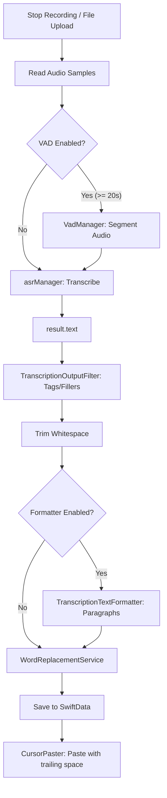

# NoteScribe: Unified Transcription Pipeline Analysis

## 1. Model Output & Initial State

The raw text generated by the system follows these rules:

* **Punctuation/Caps:** The CoreML output comes directly from `asrManager.transcribe(...)` as `result.text`. **No punctuation or capitalization is added by the Swift code.** * **Formatting Limitations:** `TranscriptionTextFormatter` is responsible only for splitting or joining sentences into paragraphs; it does not inject punctuation or fix casing.
* **References:** * `ParakeetTranscriptionService.swift` (Line 77)
* `TranscriptionState.swift` (Line 260)
* `TranscriptionTextFormatter.swift` (Line 4)

## 2. Processing Order & Logic Paths

### A. Live (Hotkey) Path

1. **Trigger:** `TranscriptionState.toggleRecord()` (Stop branch) calls `transcribeAudio(...)`.
2. **Audio Processing:** Calls `ParakeetTranscriptionService.transcribe` with `useVAD` (Voice Activity Detection) based on `IsVADEnabledLive`.
* If `duration >= 20s` and `VAD` is enabled, `VadManager.segmentSpeechAudio` runs first.

3. **ASR Execution:** CoreML runs on the audio array to return `result.text`.
4. **Post-ASR Pipeline (Sequential):**
* **Filter:** `TranscriptionOutputFilter.filter` (Removes tags, bracketed text, filler words).
* **Trim:** Standard whitespace trimming.
* **Format:** `TranscriptionTextFormatter.format` (Paragraph chunking if enabled).
* **Replace:** `WordReplacementService.applyReplacements`.

5. **Final Action:** Save transcription record and execute `CursorPaster.pasteAtCursor(text + " ")`. Note the **trailing space** added during paste.

### B. File Transcription Path

Follows the same logical order via `AudioFileTranscriptionService.retranscribeAudio`:

1. `parakeetTranscriptionService.transcribe` (using `IsVADEnabledFile`).
2. `TranscriptionOutputFilter.filter`.
3. `trim`.
4. `TranscriptionTextFormatter.format` (if enabled).
5. `WordReplacementService.applyReplacements`.

---

## 3. Detailed Component Behavior

### Word Replacement Service

* **Storage:** Managed via `UserDefaults` dictionary `wordReplacements`.
* **Case Sensitivity:** Entirely **case-insensitive**.
* **Language Handling:** * **Spaced Languages:** Uses word-boundary regex `\\b...\\b`.
* **Non-Spaced Scripts (CJK, Thai, etc.):** Falls back to case-insensitive substring replacement.

* **Logic:** Comma-separated variants in a single key are split at "apply time," allowing one entry to represent multiple original terms.
* **Timing:** Runs **after** both the output filter and text formatting.
* **References:** `WordReplacementService.swift` (Lines 8, 18, 27, 30, 49).

### Transcription Output Filter

* **Regex Logic:** Removes filler words using regex that accounts for an **optional trailing comma or period**.
* **Case Sensitivity:** Case-insensitive.
* **References:** `TranscriptionOutputFilter.swift` (Lines 33, 35).

---

## 4. Visualized Code Path (Audio → Final Text)

---

## 5. Critical Implications for Filler-Word Patterns

Based on the current architecture, take note of the following behaviors when managing filler words or phrases:

* **Punctuation Resilience:** The `TranscriptionOutputFilter` already handles optional `,` or `.` for single words. You do **not** need to create separate entries for "like" and "like,".
* **Casing:** Because the filter is case-insensitive, you do **not** need to provide capitalized variants (e.g., "Umm" vs "umm").
* **Multi-Word Limitation:** Current word-boundary replacement (`\b`) will fail on phrases like "like, you know" if there is punctuation embedded between the words.
* **Strategic Recommendation:** To handle complex multi-word filler phrases, the system would require:
1. A regex-aware filter that allows optional punctuation between tokens.
2. OR a normalization step that strips all punctuation before performing the phrase match.

